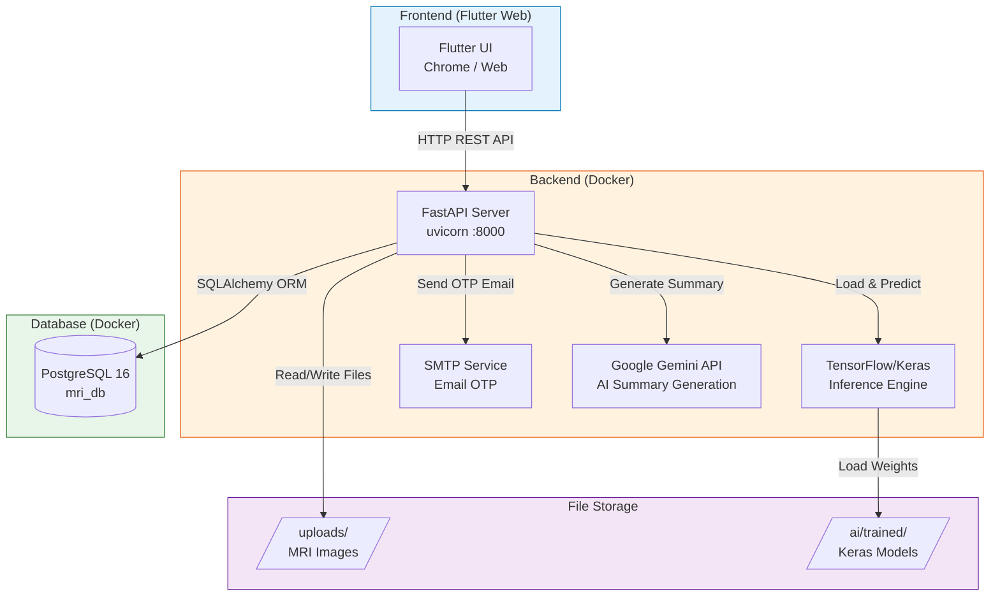
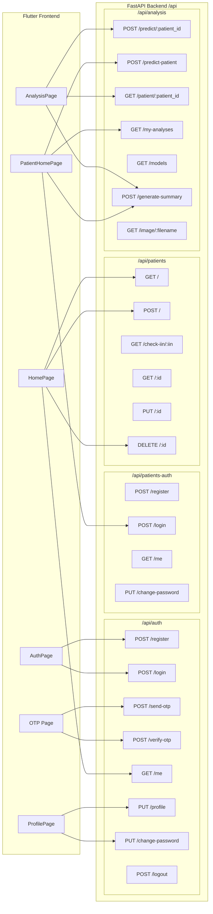
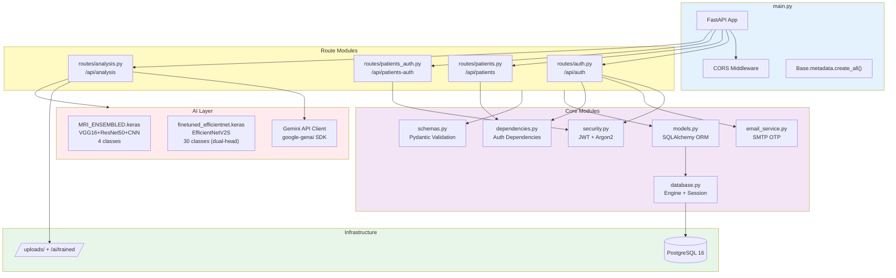
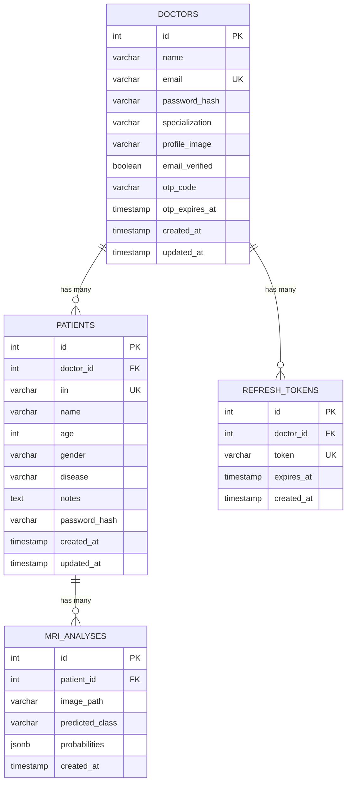
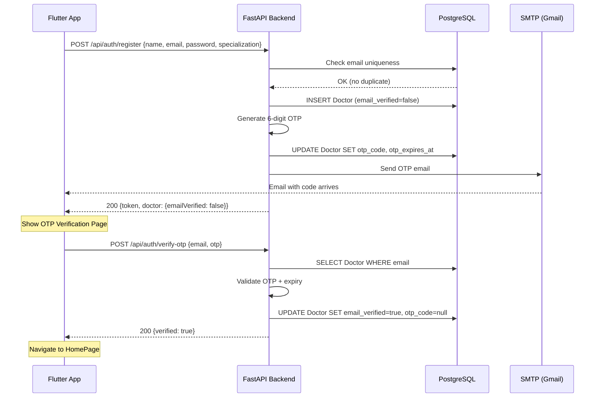
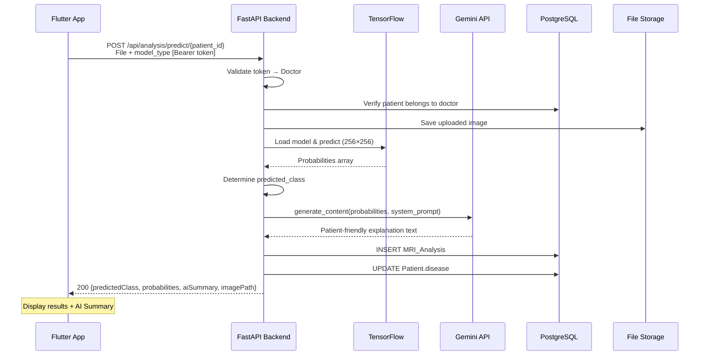
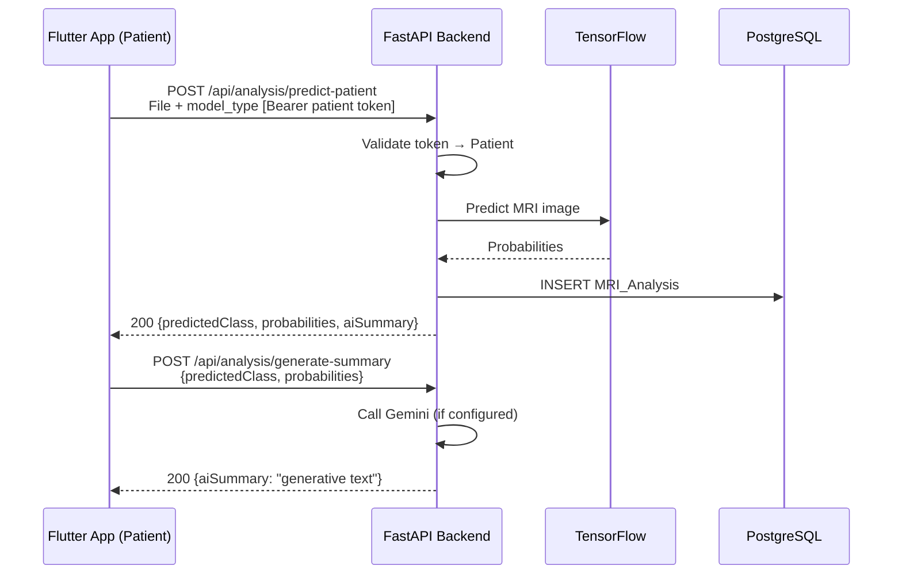
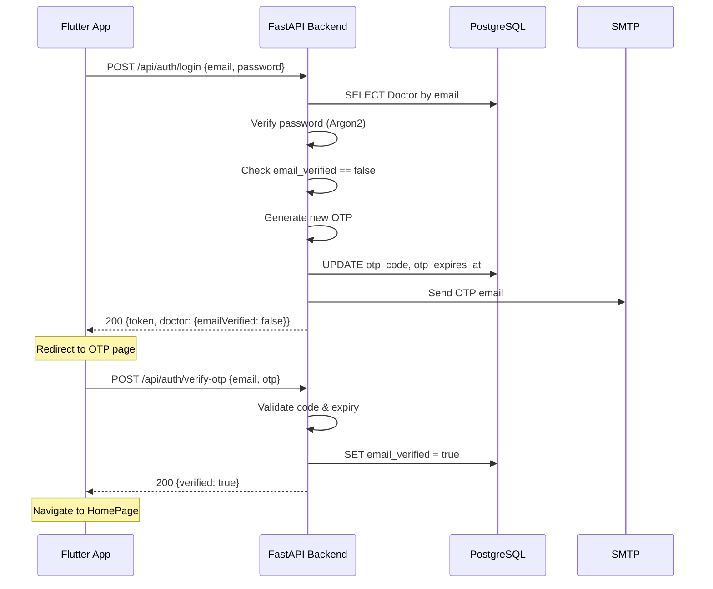

# MRI Analysis System — Architecture & Documentation

## Table of Contents
1. [Model Metrics](#1-model-metrics)
2. [System Architecture (Component Diagram)](#2-system-architecture)
3. [HTTP API Diagram (Frontend → Backend)](#3-http-api-diagram)
4. [Backend Architecture](#4-backend-architecture)
5. [ERD Diagram](#5-erd-diagram)
6. [Sequence Diagrams](#6-sequence-diagrams)

---

## 1. Model Metrics

### Ensemble Model (4 classes: Glioma, Meningioma, No Tumor, Pituitary)

| Metric | Description | Formula |
|--------|-------------|---------|
| **Accuracy** | Overall correct predictions | TP+TN / (TP+TN+FP+FN) |
| **Precision** | Positive predictive value per class | TP / (TP+FP) |
| **Recall (Sensitivity)** | True positive rate per class | TP / (TP+FN) |
| **Specificity** | True negative rate per class | TN / (TN+FP) |
| **F1-score** | Harmonic mean of Precision & Recall | 2·(P·R)/(P+R) |
| **ROC-AUC** | Area under receiver operating curve | One-vs-Rest per class |

### Confusion Matrix (4×4)

```
                 Predicted
              Gli  Men  NoT  Pit
Actual Gli  [ TP   .    .    .  ]
       Men  [  .   TP   .    .  ]
       NoT  [  .    .   TP   .  ]
       Pit  [  .    .    .   TP ]
```

### EfficientNetV2S Model (30 classes: Diagnosis × MRI Sequence)

Same metrics apply in a **30×30 confusion matrix**, evaluated with macro/weighted averaging for Precision, Recall, F1.

---

## 2. System Architecture



---

## 3. HTTP API Diagram



---

## 4. Backend Architecture



---

## 5. ERD Diagram



---

## 6. Sequence Diagrams

### 6.1 Doctor Registration + Email OTP Verification



### 6.2 MRI Analysis (Doctor uploads for Patient)



### 6.3 Patient Self-Service Analysis



### 6.4 Doctor Login with OTP (unverified email)



---

## Technology Stack

| Layer | Technology |
|-------|-----------|
| Frontend | Flutter 3.29+ (Web/Chrome) |
| Backend | Python 3.12, FastAPI, Uvicorn |
| Database | PostgreSQL 16 (Alpine) |
| ORM | SQLAlchemy 2.0+ |
| Auth | JWT (python-jose), Argon2 (passlib) |
| AI Models | TensorFlow/Keras (VGG16, ResNet50V2, CNN ensemble; EfficientNetV2S) |
| AI Summary | Google Gemini API (google-genai SDK) |
| Email | SMTP (Gmail app password) |
| Container | Docker Compose |
| Image Input | JPEG, PNG, WebP, DICOM (.dcm → pydicom conversion) |

---

## AI Models Summary

### Ensemble Model (`MRI_ENSEMBLED.keras`)
- **Architecture**: Concatenation of VGG16 + ResNet50V2 + Custom CNN → BatchNorm → GlobalAveragePooling2D → Dense(512, ReLU) → Dense(4, linear logits)
- **Input**: 256×256×3
- **Output**: 4 logits → softmax applied at inference
- **Classes**: `glioma`, `meningioma`, `notumor`, `pituitary`
- **Loss**: CategoricalCrossentropy (from_logits=True)

### EfficientNetV2S Dual-Head (`finetuned_efficientnet.keras`)
- **Architecture**: EfficientNetV2S (ImageNet pretrained) → Dual head:
  - Head 1: Classification → Dense(30, softmax)
  - Head 2: Localization → Gaussian heatmap (sigmoid)
- **Input**: 256×256×3
- **Output**: 30-class softmax probabilities
- **Classes**: 10 diagnoses × 3 MRI sequences (T1, T2, T1C+)
  - Glioma, Meningioma, Astrocytoma, Ependymoma, Oligodendroglioma, Schwannoma, Neurocytoma, Hemangiopericytoma, Normal, Other
- **Training**: 2-phase (frozen backbone → full fine-tune)
